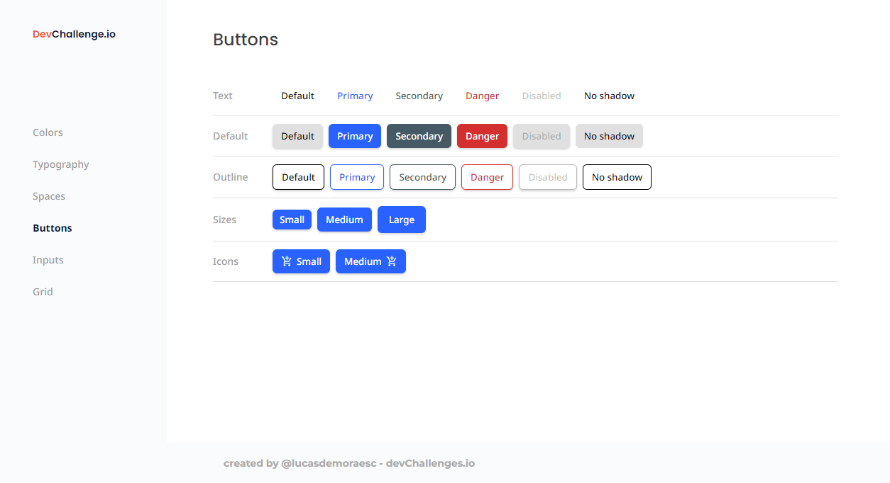

<h1 align="center">Reusable Components</h1>

<div align="center">
   Solution for a challenge from  <a href="http://devchallenges.io" target="_blank">Devchallenges.io</a>.
</div>

<div align="center">
  <h3>
    <a href="https://devchallenge-components.vercel.app/" target="_blank">
      Demo
    </a>
    <span> | </span>
    <a href="https://github.com/lucasdemoraesc/reusable-components">
      Solution
    </a>
    <span> | </span>
    <a href="https://devchallenges.io/paths/front-end-developer" target="_blank">
      Challenge
    </a>
  </h3>
</div>

<!-- TABLE OF CONTENTS -->

## Table of Contents

- [Table of Contents](#table-of-contents)
- [Overview](#overview)
  - [Built With](#built-with)
- [Features](#features)
- [How To Use](#how-to-use)
- [Acknowledgements](#acknowledgements)
- [Contact](#contact)

<!-- OVERVIEW -->

## Overview



This project contains implementations for challenges related to creating reusable components. Here is a brief description of what has already been done:

- **[Navigation Components:](./src/app/layout/)** Footer, Sidebar and Content Container. These aren't related to any challenges, but I wanted to implement them to practice a little CSS, the result was very satisfying.
- **[Button Component:](./src/app/components/button/)** Implementation of a stylized and reusable button component for this [challenge](https://devchallenges.io/challenges/ohgVTyJCbm5OZyTB2gNY). Its implementation uses the standard Angular component structure but with some specifics, such as the `selector`, which has been modified to satisfy User Story eight: *I can still access all button attributes*.

### Built With

- [Angular](https://angular.io/)

## Features

This application/site was created as a submission to a [DevChallenges](https://devchallenges.io/challenges) challenge. The [challenge](https://devchallenges.io/challenges/ohgVTyJCbm5OZyTB2gNY) was to build an application to complete the given user stories.

## How To Use

<!-- This is an example, please update according to your application -->

To clone and run this application, you'll need [Git](https://git-scm.com) and [Node.js](https://nodejs.org/en/download/) (which comes with [npm](http://npmjs.com)) installed on your computer. From your command line:

```bash
# Clone this repository
$ git clone https://github.com/lucasdemoraesc/reusable-components

# Open a terminal in the cloned project folder. Then...
# Install dependencies
$ npm install

# Run the app
$ npm start
```

## Acknowledgements

- [Ng-Zorro-Antd](https://github.com/NG-ZORRO/ng-zorro-antd): A simple and clean component library for Angular. I used some of your concepts in my implementation.

## Contact

- Linkedin [@lucasdemoraesc](https://linkedin.com/in/lucasdemoraesc)
- GitHub [@lucasdemoraesc](https://github.com/lucasdemoraesc)
- Behance [@lucasdemoraesc](https://www.behance.net/lucasdemoraesc)
